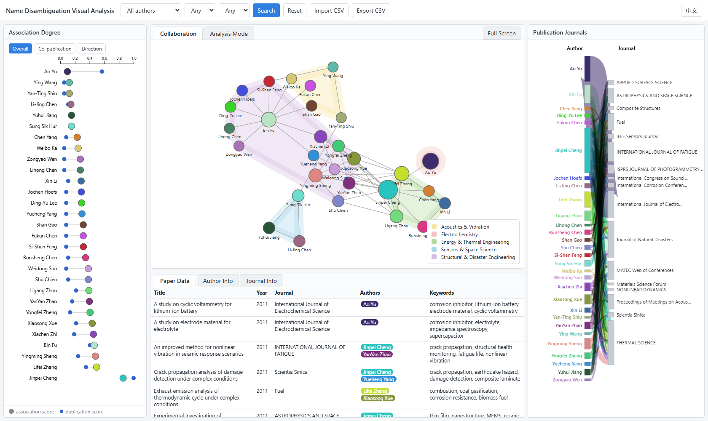
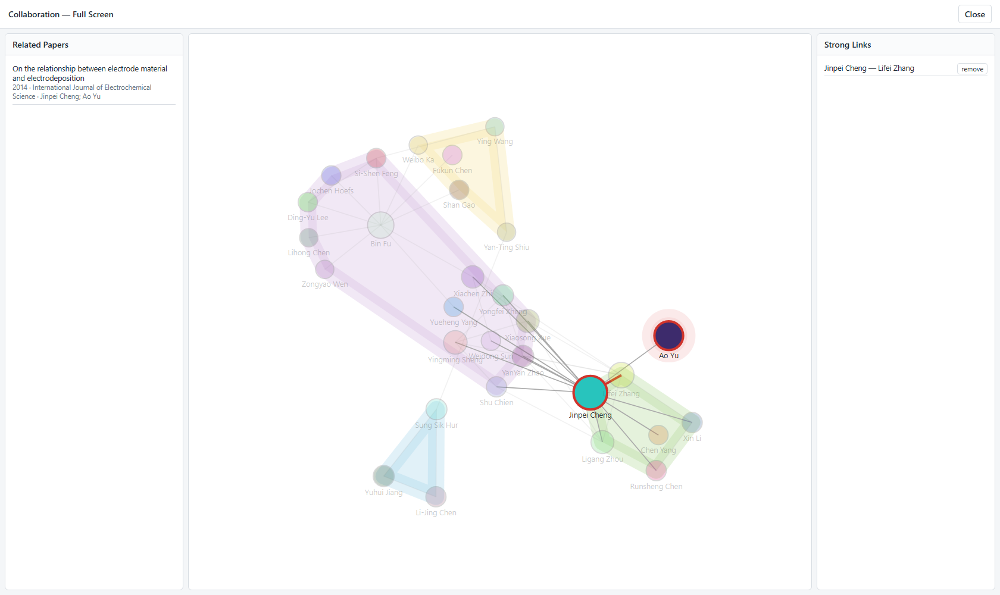

# Visual Analysis for Name Disambiguation of Academic Papers

Interactive visual-analytics system accompanying

> Pengyu Zhang, Yong Zhang, Yanjie Cui, Baocai Yin.
> **Visual Analysis for Name Disambiguation of Academic Papers** (in Chinese).
> *Journal of Computer-Aided Design & Computer Graphics* 34(11): 1659–1672, 2022.
> [DOI](https://doi.org/10.3724/SP.J.1089.2022.19191) · [Paper PDF](https://pengyu-zhang.github.io/pdf/Visual_Analysis.pdf) · Demo video: [YouTube](https://www.youtube.com/watch?v=jQ8MNu-L-Os) / [Bilibili](https://www.bilibili.com/video/BV1QM4m1k77Q/)

## Method

When different authors share one name, research offices and retrieval systems
struggle to assign papers to the right person. This system supports that
disambiguation work visually: a search over a paper table produces a
"disambiguation set", whose authors are shown as a force-directed
collaboration network with research-direction groupings, side by side with an
association-degree chart (how strongly each author is tied to the team versus
how much they publish) and an author–journal flow diagram. Suspicious
authors — weakly associated with the team yet publishing a lot, in journals
nobody else in the team uses — stand out immediately and can be verified
against the raw paper records, then fixed by splitting or removing nodes and
exporting the corrected table.

The four coordinated modules from the paper: **query** (search, CSV
import/export), **association degree** (dumbbell chart), **collaboration**
(force network + journal Sankey, with a full-screen mode for inspecting
links, shared papers and strong ties), and **basic information** (paper
table, author profile with keywords/years/metrics, journal profile).



The interface is bilingual (English default, 中文 toggle in the top-right
corner). The deep-learning classifier used in the paper to label research
directions is a separate model — see
[MVMA-GCN](https://github.com/pengyu-zhang/MVMA-GCN); this app accepts its
labels through an optional CSV column and otherwise falls back to a
journal-based heuristic.

## Repository structure

```
index.html        the app (open via any static HTTP server)
css/  js/         styles and modules (vanilla JavaScript + D3, no build step)
vendor/           vendored D3 v7, d3-sankey, d3-cloud (offline, see vendor/LICENSES.md)
data/             bundled demo dataset + CSV format documentation
scripts/          one-click shell scripts (Linux / WSL / Git Bash)
original_code/    the original prototype code, archived
docs/             refactoring notes and screenshots
```

## Requirements

Any modern browser plus any static HTTP server — Python 3 is enough. There
are no packages to install, no build step, and no backend.

## Quick start

```bash
bash scripts/run_all.sh        # smoke test, then serve on http://localhost:8000/
```

or directly:

```bash
python -m http.server 8000     # from the repository root
# open http://localhost:8000/
```

or with Docker:

```bash
docker build -t vand .
docker run --rm -p 8080:80 vand   # open http://localhost:8080/
```

## Using the system

1. **Search** an author (e.g. *Jinpei Cheng*) with an optional year range —
   the collaboration teams around that name appear in all views.
2. Check the **Association Degree** panel: a large circle far left (low
   association) with a small circle far right (many publications) marks a
   suspicious author — in the demo data, *Ao Yu*.
3. Click nodes to cross-filter the **journal view** and open the author
   profile; a suspicious author typically publishes in a single journal that
   no other team member uses.
4. **Full Screen** shows the papers shared by selected authors and lets you
   mark strong links; right-click a node to **split** an author (one node per
   collaborator group, e.g. `Wang Wei 01/02/03`) or **delete** it.
5. **Export CSV** saves the corrected paper table.

Bring your own data with **Import CSV**; the expected columns are documented
in [data/README.md](data/README.md).

## Expected result

With the bundled demo dataset (29 authors, 108 papers), searching
*Jinpei Cheng* reproduces the paper's case study 2: *Ao Yu* has the lowest
association score but the second-highest publication count, publishes only in
*International Journal of Electrochemical Science* (which no other team
member uses), collaborated with only one person on a single 2014 paper, and
published nothing after 2015 — the signature of a wrongly assigned name.



## Citation

```bibtex
@article{zhang2022visualnd,
  title   = {Visual Analysis for Name Disambiguation of Academic Papers},
  author  = {Zhang, Pengyu and Zhang, Yong and Cui, Yanjie and Yin, Baocai},
  journal = {Journal of Computer-Aided Design \& Computer Graphics},
  volume  = {34},
  number  = {11},
  pages   = {1659--1672},
  year    = {2022},
  doi     = {10.3724/SP.J.1089.2022.19191},
  note    = {in Chinese}
}
```

## Note on `original_code/`

`original_code/` archives the original prototype implementation for
reference. The rewrite — including the replacement of commercial charting
libraries, the removal of hardcoded data and the anonymization applied to the
archive — is documented in [docs/REFACTORING_NOTES.md](docs/REFACTORING_NOTES.md).

---

Maintained by [Pengyu Zhang](https://pengyu-zhang.github.io/).
