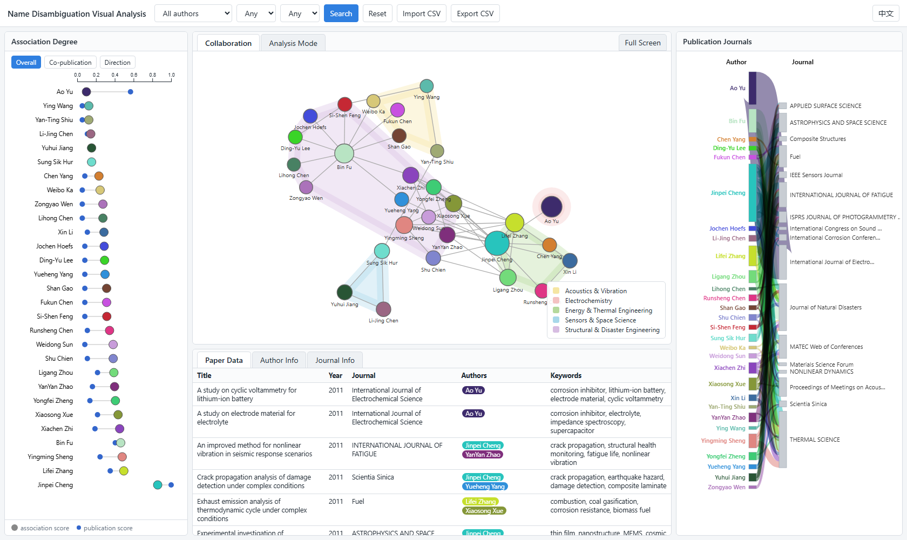
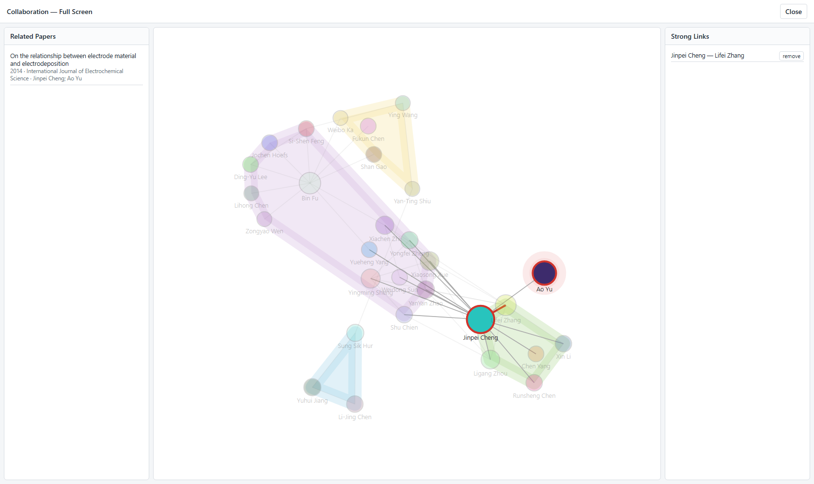

<div align="center">

# Visual Analysis for Name Disambiguation of Academic Papers

<a href="https://pengyu-zhang.github.io/Visual-Analysis-for-Name-Disambiguation-of-Academic-Papers/"></a>
<a href="https://doi.org/10.3724/SP.J.1089.2022.19191"></a>
<a href="https://pengyu-zhang.github.io/pdf/Visual_Analysis.pdf"></a>
<a href="https://www.youtube.com/watch?v=jQ8MNu-L-Os"></a>
<a href="LICENSE"></a>



</div>

Interactive visual-analytics system accompanying the paper *Visual Analysis
for Name Disambiguation of Academic Papers* (in Chinese) by Pengyu Zhang,
Yong Zhang, Yanjie Cui and Baocai Yin, published in the *Journal of
Computer-Aided Design & Computer Graphics* 34(11): 1659–1672, 2022. When
different authors share one name, research offices and retrieval systems
struggle to assign papers to the right person; this system supports that
disambiguation work visually. A demo video is also available on
[Bilibili](https://www.bilibili.com/video/BV1QM4m1k77Q/).

**[Live demo](https://pengyu-zhang.github.io/Visual-Analysis-for-Name-Disambiguation-of-Academic-Papers/)** —
the app runs entirely in the browser; no installation needed.

## Overview

A search over a paper table produces a "disambiguation set", whose authors
are shown as a force-directed collaboration network with research-direction
groupings, side by side with an association-degree chart (how strongly each
author is tied to the team versus how much they publish) and an
author–journal flow diagram. Suspicious authors — weakly associated with the
team yet publishing a lot, in journals nobody else in the team uses — stand
out immediately and can be verified against the raw paper records, then
fixed by splitting or removing nodes and exporting the corrected table.

The four coordinated modules from the paper: **query** (search, CSV
import/export), **association degree** (dumbbell chart), **collaboration**
(force network + journal Sankey, with a full-screen mode for inspecting
links, shared papers and strong ties), and **basic information** (paper
table, author profile with keywords/years/metrics, journal profile).

The interface is bilingual (English default, 中文 toggle in the top-right
corner). The deep-learning classifier used in the paper to label research
directions is a separate model — see
[MVMA-GCN](https://github.com/pengyu-zhang/MVMA-GCN); this app accepts its
labels through an optional CSV column and otherwise falls back to a
journal-based heuristic.

## Repository structure

```text
├── css/              # styles
├── data/             # bundled demo dataset + CSV format documentation
├── docs/             # screenshots used in this README
├── js/               # app modules (vanilla JavaScript + D3)
├── scripts/          # demo-data generation, smoke test, local serving
├── vendor/           # vendored D3 v7, d3-sankey, d3-cloud (see vendor/LICENSES.md)
├── Dockerfile        # static hosting with nginx
└── index.html        # the app (open via any static HTTP server)
```

## Installation

There is nothing to install: the app is plain HTML/CSS/JavaScript with all
libraries vendored — no packages, no build step, no backend. Any modern
browser plus any static HTTP server (Python 3 is enough) will do.

## Data

The bundled demo dataset [data/demo_papers.csv](data/demo_papers.csv)
contains the anonymized author team from the paper's case study (29 authors,
108 papers) and can be regenerated deterministically with
`bash scripts/prepare_data.sh`. To bring your own data, use **Import CSV**
in the app; the expected columns are documented in
[data/README.md](data/README.md).

## 🚀 Quick start

The fastest path is the hosted
[live demo](https://pengyu-zhang.github.io/Visual-Analysis-for-Name-Disambiguation-of-Academic-Papers/).
To run locally:

```bash
bash scripts/run_all.sh        # smoke test, then serve on http://localhost:8000/
```

or directly:

```bash
python -m http.server 8000     # from the repository root
# open http://localhost:8000/
```

or with Docker:

```bash
docker build -t vand .
docker run --rm -p 8080:80 vand   # open http://localhost:8080/
```

## Usage

1. **Search** an author (e.g. *Jinpei Cheng*) with an optional year range —
   the collaboration teams around that name appear in all views.
2. Check the **Association Degree** panel: a large circle far left (low
   association) with a small circle far right (many publications) marks a
   suspicious author — in the demo data, *Ao Yu*.
3. Click nodes to cross-filter the **journal view** and open the author
   profile; a suspicious author typically publishes in a single journal that
   no other team member uses.
4. **Full Screen** shows the papers shared by selected authors and lets you
   mark strong links; right-click a node to **split** an author (one node per
   collaborator group, e.g. `Wang Wei 01/02/03`) or **delete** it.
5. **Export CSV** saves the corrected paper table.

## 📊 Results

With the bundled demo dataset (29 authors, 108 papers), searching
*Jinpei Cheng* reproduces the paper's case study 2: *Ao Yu* has the lowest
association score but the second-highest publication count, publishes only in
*International Journal of Electrochemical Science* (which no other team
member uses), collaborated with only one person on a single 2014 paper, and
published nothing after 2015 — the signature of a wrongly assigned name.

<div align="center">

</div>

## 📝 Citation

```bibtex
@article{zhang2022visualnd,
  title   = {Visual Analysis for Name Disambiguation of Academic Papers},
  author  = {Zhang, Pengyu and Zhang, Yong and Cui, Yanjie and Yin, Baocai},
  journal = {Journal of Computer-Aided Design \& Computer Graphics},
  volume  = {34},
  number  = {11},
  pages   = {1659--1672},
  year    = {2022},
  doi     = {10.3724/SP.J.1089.2022.19191},
  note    = {in Chinese}
}
```

## 🙏 Acknowledgments & License

The visualizations are built on [D3.js](https://github.com/d3/d3),
[d3-sankey](https://github.com/d3/d3-sankey) and
[d3-cloud](https://github.com/jasondavies/d3-cloud), vendored under their
respective licenses (see [vendor/LICENSES.md](vendor/LICENSES.md)). The
research-direction classifier used in the paper is available separately as
[MVMA-GCN](https://github.com/pengyu-zhang/MVMA-GCN).

This repository is released under the [MIT License](LICENSE).

---

Maintained by [Pengyu Zhang](https://pengyu-zhang.github.io/).
